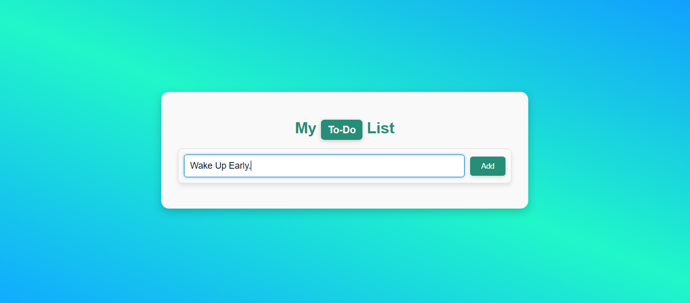
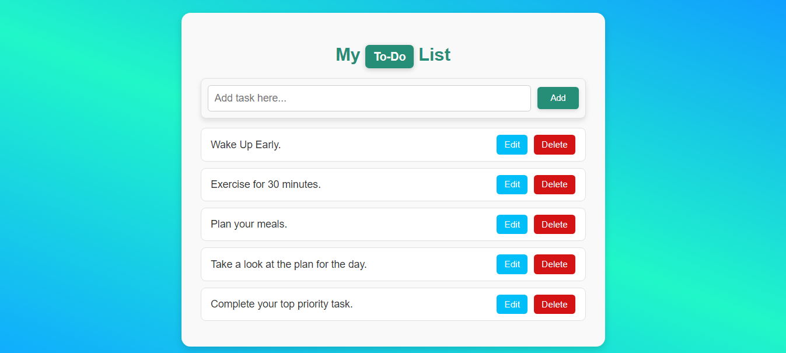
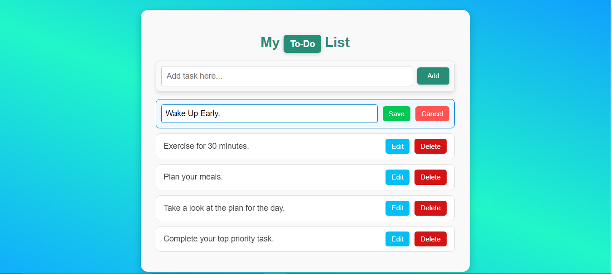
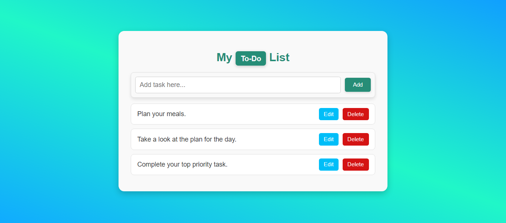

# Todo List Application

This is a simple Todo List application built with React, TypeScript, and Vite.

## Features
- **Add Tasks**: Easily add tasks to your list and store them in local storage for persistence.
- **Edit Tasks**: Modify existing tasks by clicking the edit button.
- **Save Edits**: Save changes made to tasks by clicking the save button.
- **Cancel Edits**: Revert edits and return to the original task by clicking the cancel button.
- **Remove Tasks**: Delete tasks from the list by clicking the delete button.

## Getting Started
Prerequisites
- Node.js (version 14 or above)
- npm or yarn

## Installation
1. Clone the repository:
- git clone https://github.com/SalasDelil/Todo-List-App-with-React-and-Typescript.git
2. Navigate to the project directory:
- cd Todo-List-App-with-React-and-Typescript
3. Install the dependencies:
- `npm install`
or
- `yarn instal`

## Running the Application
1. Start the development server:
- `npm run dev`
or
- `yarn dev`
2. Open your browser and navigate to:
- http://localhost:5173
to view and use the Todo List application.

## Building for Production
To build the application for production, use the following command:
- `npm run build`
or 
- `yarn build`

The production-ready files will be in the dist directory.

## Project Structure
- `index.html`: The main HTML file containing the structure of the Todo List application.
- `src/css/style.css`: The CSS file containing the styles for the Todo List application.
- `src/components/`: React components for adding, editing, and removing tasks.
- `src/App.tsx`: The main React component containing the logic and structure of the application.
- `vite.config.ts`: Vite configuration file.

Screenshot
Add new todo tasks by typing in the input field.

List of tasks will be displayed under the input field.

To edit a task, press the edit button and save changes.

Press the delete button to remove a task from the todo list.

## Instructions for Running

1. Clone the repository or download the project files.
2. Compile the TypeScript file to JavaScript using the command: `tsc todo.ts --outFile todo.js`
3. Open `index.html` in your web browser to view and use the Todo List application.

## Project Structure

- `index.html`: The main HTML file containing the structure of the Todo List application.
- `styles/style.css`: The CSS file containing the styles for the Todo List application.
- `scripts/todo.ts`: The TypeScript file containing the logic for adding, editing, and removing tasks.
- `scripts/todo.js`: The JavaScript file compiled from the TypeScript file.

## Screenshot

Add new todo task by typing over the input field.

List of tasks will be displayed under the input field.

To edit a task, press the edit button and save changes.

Press delete button to remove a task from the todo list.
